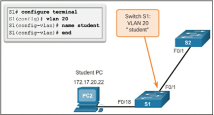
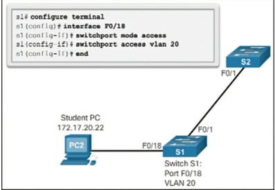
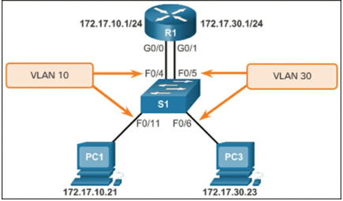
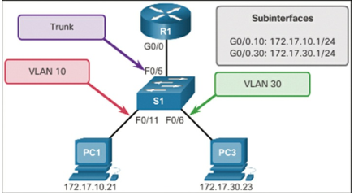

## Dynamic Routing
### RIPv1

> RIPv1 is a classful routing protocol for IPv4. Therefore, if a subnet address is entered, the IOS automatically converts it to the classful network address. For example, entering the network 192.168.1.32 command would automatically be converted to network 192.168.1.0 in the running configuration file. The IOS does not give an error message but instead corrects the input and enters the classful network address.
#### Enable RIP Routing
```
R1# conf t
Enter configuration commands, one per line. End with CNTL/Z.
R1(config)# router rip
R1(config-router)#
```
#### Disable RIP Routing
```
R1# conf t
R1(config)# no router rip
```
#### Network command is used to advertise the R1 directly connected networks.
```
R1(config)# router rip
R1(config-router)# network 192.168.1.0
R1(config-router)# network 192.168.2.0
R1(config-router)#
```
#### Verify RIP Routing
```
R1# show ip protocols
*** IP Routing is NSF aware ***
Routing Protocol is "rip"
Outgoing update filter list for all interfaces is not set
Incoming update filter list for all interfaces is not set
Sending updates every 30 seconds, next due in 16 seconds Invalid after 180 seconds, hold down 180, flushed after 240
Redistributing: rip
Default version control: send version 1, receive any version
Interface Send Recv Triggered RIP Key-chain
GigabitEthernet0/0 1 1 2
Serial0/0/0 1 1 2
Automatic network summarization is in effect
Maximum path: 4
Routing for Networks:
192.168.1.0
192.168.2.0
Routing Information Sources:
Gateway Distance Last Update
192.168.2.2 120 00:00:15
Distance: (default is 120)
R1#
```
This output confirms most RIP parameters, including the following:
- RIP routing is configured and running on router R1.
- The values of various timers; for example, the next routing update will be sent by R1 in 16 seconds.
- The version of RIP configured is currently RIPv1.
- R1 is currently summarizing at the classful network boundary.
- The classful networks are advertised by R1. These are the networks that R1 includes in its RIP updates.
- The RIP neighbors are listed, including their next-hop IP address, the associated advertised distance that R2 uses for updates sent by this neighbor, and when the last update was received from this neighbor.
### RIPv2
#### Enable and Verify RIPv2
```
R1(config)# router rip
R1(config-router)# version 2
R1(config-router)# end
R1#
R1# show ip protocols | section Default
Default version control: send version 2, receive version 2
Interface Send Recv Triggered RIP Key-chain
GigabitEthernet0/0 2 2
Serial0/0/0 2 2
R1#
```
#### Disable Auto-Summarization
```
R1(config)# router rip
R1(config-router)# no auto-summary
R1(config-router)# end
R1#
*Mar 10 14:11:49.659: %SYS-5-CONFIG_I: Configured from console by console
R1# show ip protocols | section Automatic
Automatic network summarization is not in effect
R1#
```
#### Configure Passive Interfaces
> RIP updates really only need to be sent out interfaces that are connected to other RIP enabled routers.
```
R1(config)# router rip
R1(config-router)# passive-interface g0/0
R1(config-router)# end
R1#
R1# show ip protocols | begin Default
Default version control: send version 2, receive version 2
Interface Send Recv Triggered RIP Key-chain
Serial0/0/0 2 2
Automatic network summarization is not in effect
Maximum path: 4
Routing for Networks:
 192.168.1.0
 192.168.2.0
Passive Interface(s):
 GigabitEthernet0/0
Routing Information Sources:
 Gateway Distance Last Update
 192.168.2.2 120 00:00:06
Distance: (default is 120)
R1#
```
#### Propagate a Default Route
> To propagate a default route in RIP, the edge router must be configured with two things:
 - A default static route using the **ip route 0.0.0.0 0.0.0.0** command.
 - The **default-information originate** router configuration command. This instructs R1 to originate default information by propagating the static default route in RIP updates.
```
R1(config)# ip route 0.0.0.0 0.0.0.0 S0/0/1
209.165.200.226
R1(config)#
R1(config)# router rip
R1(config-router)# default-information originate
R1(config-router)# end
R1#
```
#### Verify the routing table
```
R3# show ip route | begin Gateway
Gateway of last resort is 192.168.4.2 to network 0.0.0.0
R* 0.0.0.0/0 [120/2] via 192.168.4.2, 00:00:00,
Serial0/0/1
R 192.168.1.0/24 [120/2] via 192.168.4.2, 00:00:00,
Serial0/0/1
R 192.168.2.0/24 [120/1] via 192.168.4.2, 00:00:00,
Serial0/0/1
R 192.168.3.0/24 [120/1] via 192.168.4.2, 00:00:00,
Serial0/0/1
192.168.4.0/24 is variably subnetted, 2 subnets, 2 masks
C 192.168.4.0/24 is directly connected, Serial0/0/1
L 192.168.4.1/32 is directly connected, Serial0/0/1
192.168.5.0/24 is variably subnetted, 2 subnets, 2 masks
C 192.168.5.0/24 is directly connected, GigabitEthernet0/0
L 192.168.5.1/32 is directly connected, GigabitEthernet0/0
R3#
```

## VLAN
#### View VLAN Default Port Assignments (In switch config)
```
Switch# show vlan brief
VLAN Name Status Ports
---- --------------------------- --------- ---------------
----------------
1 default active Fa0/1, Fa0/2, Fa0/3, Fa0/4 Fa0/5, Fa0/6, Fa0/7, Fa0/8
Fa0/9, Fa0/10, Fa0/11, Fa0/12 Fa0/13, Fa0/14, Fa0/15, Fa0/16
Fa0/17, Fa0/18, Fa0/19, Fa0/20 Fa0/21, Fa0/22, Fa0/23, Fa0/24
Gi0/1, Gi0/2
1002 fddi-default act/unsup
1003 token-ring-default act/unsup
1004 fddinet-default act/unsup
1005 trnet-default act/unsup
```
VLAN 1 has all the features of any VLAN, except it cannot be renamed or deleted. By default, all Layer 2 control traffic is associated with VLAN 1.

#### Creating a VLAN


```
S1# configure terminal
S1(config)# vlan 20
S1(config-vlan)# name student
S1(config-vlan)# end
```
Student VLAN (VLAN 20) is configured on switch S1. In the topology example, the student computer (PC2) has not been associated with a VLAN yet, but it does have an IP address of 172.17.20.22.
#### Creating Multiple VLANs
```
S1# configure terminal
S1(config)# vlan 100,102,105-107
S1(config-vlan)# end
```
#### Assigning Ports to VLANs
After creating a VLAN, the next step is to assign ports to the VLAN because assigning ports tells the switch, _“traffic from this port belongs to VLAN X.”_
```
S1# configure terminal
S1(config)# interface F0/18
S1(config-if)# switchport mode access
S1(config-if)# switchport access vlan 20
S1(config-if)# end
```
It makes port **F0/18** an **access port** and assigns it to **VLAN 20**, so any device plugged into that port becomes part of VLAN 20.

#### Remove VLAN Port Assignment
```
S1(config)# int fa0/18
S1(config-if)# no switchport access vlan
S1(config-if)# end
S1#
S1# show vlan brief
VLAN Name Status Ports
---- ------------------------------- --------- ----------
---------------------
1 default active Fa0/1, Fa0/2, Fa0/3, Fa0/4, Fa0/5, Fa0/6, Fa0/7, Fa0/8 Fa0/9, Fa0/10, Fa0/11, Fa0/12 Fa0/13, Fa0/14, Fa0/15, Fa0/16 Fa0/17, Fa0/18, Fa0/19, Fa0/20 Fa0/21, Fa0/22, Fa0/23, Fa0/24 Gi0/1, Gi0/2

20 student active
1002 fddi-default act/unsup
1003 token-ring-default act/unsup
1004 fddinet-default act/unsup
1005 trnet-default act/unsup
```
#### Changing VLAN Port
When an access port has its VLAN membership reassigned to another existing VLAN, the new VLAN membership simply replaces the previous VLAN membership.
```
S1# config t
S1(config)# int fa0/11
S1(config-if)# switchport mode access
S1(config-if)# switchport access vlan 20
S1(config-if)# end
S1#
S1# show vlan brief
...
20 student active Fa0/11
```
#### Deleting VLAN Information
```
S1# conf t
S1(config)# no vlan 20
S1(config)# end
```
Before deleting a VLAN, reassign all member ports to a different VLAN. Any ports that are not moved to an active VLAN are unable to communicate with other hosts after the VLAN is deleted and until they are assigned to an active VLAN.
#### VLAN Trunk Configuration
A VLAN trunk is a Layer 2 link between switches that carries traffic for multiple VLANs. To use it, set both ends of the link as trunk ports.
```
S1(config)# interface FastEthernet0/1
S1(config-if)# switchport mode trunk
S1(config-if)# switchport trunk native vlan 99
S1(config-if)# switchport trunk allowed vlan 10,20,30,99
S1(config-if)# end
ES1#
```
Sets **F0/1** as a trunk carrying VLANs **10, 20, 30, and 99**, with **99** as the native VLAN. The **native VLAN** is the VLAN that carries **untagged traffic** on a trunk link — traffic without a VLAN ID.
#### Resetting VLAN to Default state
By default, a switch port is in **access mode** and belongs to **VLAN 1** (no trunking, no special settings).
- **`no switchport trunk allowed vlan`** → allows **all VLANs** on the trunk (removes any restrictions). 
- **`no switchport trunk native vlan`** → sets the **native VLAN back to VLAN 1** (removes a custom native VLAN).
One controls **which VLANs can pass**, the other controls **which VLAN is untagged**. An **untagged VLAN** is the VLAN assigned to carry **frames without a VLAN tag** on a trunk port. By default, this is the **native VLAN**.
#### Resetting a Port to Access Mode
**Access mode** is when a switch port carries traffic for **only one VLAN** and does **not tag frames**—used for connecting end devices like PCs or printers.
```
S1(config)# interface f0/1
S1(config-if)# switchport mode access
S1(config-if)# end
```
#### Configure and Verify Trunking
```
S1(config)# interface f0/1
S1(config-if)# switchport mode trunk
S1(config-if)# switchport trunk native vlan 99
S1(config-if)# end
S1#
S1# show interfaces f0/1 switchport
Name: Fa0/1
Switchport: Enabled
** Administrative Mode: trunk
Operational Mode: trunk
Administrative Trunking Encapsulation: dot1q
Operational Trunking Encapsulation: dot1q **

Negotiation of Trunking: On
Access Mode VLAN: 1 (default)
Trunking Native Mode VLAN: 99 (VLAN0099)
Administrative Native VLAN tagging: enabled
Voice VLAN: none
Administrative private-vlan host-association: none
Administrative private-vlan mapping: none
Administrative private-vlan trunk native VLAN: none
Administrative private-vlan trunk Native VLAN tagging:
enabled
Administrative private-vlan trunk encapsulation: dot1q
Administrative private-vlan trunk normal VLANs: none
Administrative private-vlan trunk associations: none
Administrative private-vlan trunk mappings: none
Operational private-vlan: none

** Trunking VLANs Enabled: ALL **
<output omitted>
```
#### Legacy Inter-VLAN Routing

This setup is a classic example of **Inter-VLAN Routing**. Here’s the main goal:
- **VLANs Create Separation:** By default, devices in **VLAN 10** (like PC1) are in their own isolated broadcast domain and _cannot_ communicate with devices in **VLAN 30** (like PC3). They are on completely different subnets (172.17.10.0/24 and 172.17.30.0/24).
- **Routers Create Connection:** To allow communication _between_ these two different networks, you must use a Layer 3 device (a router).
- **The Solution:** The router (R1) is configured to act as the **default gateway** for _both_ VLANs, allowing it to receive traffic from one VLAN and "route" it to the other.
##### Switch Configuration
```
S1(config)# vlan 10 , 30
S1(config-vlan)# exit
S1(config)#
S1(config)# interface f0/11
S1(config-if)# switchport access vlan 10
S1(config-if)# interface f0/4
S1(config-if)# switchport access vlan 10
S1(config-if)# interface f0/6
S1(config-if)# switchport access vlan 30
S1(config-if)# interface f0/5
S1(config-if)# switchport access vlan 30
S1(config-if)# end
*Mar 20 01:22:56.751: %SYS-5-CONFIG_I: Configured from
console by console
S1#
S1# copy running-config startup-config
Destination filename [startup-config]?
Building configuration...
[OK]
```
Creates **VLANs 10 and 30**, assigns ports **F0/11 & F0/4** to VLAN 10 and **F0/6 & F0/5** to VLAN 30, then saves the configuration.
##### Router Configuration
```
R1(config)# interface g0/0
R1(config-if)# ip address 172.17.10.1 255.255.255.0
R1(config-if)# no shutdown
*Mar 20 01:42:12.951: %LINK-3-UPDOWN: Interface
GigabitEthernet0/0, changed state to up
*Mar 20 01:42:13.951: %LINEPROTO-5-UPDOWN: Line protocol on Interface
GigabitEthernet0/0, changed state to up
R1(config-if)# interface g0/1
R1(config-if)# ip address 172.17.30.1 255.255.255.0
R1(config-if)# no shutdown
*Mar 20 01:42:54.951: %LINK-3-UPDOWN: Interface GigabitEthernet0/1, changed state
to up
*Mar 20 01:42:55.951: %LINEPROTO-5-UPDOWN: Line protocol on Interface
GigabitEthernet0/1, changed state to up
R1(config-if)# end
R1# copy running-config startup-config
R1#
```
Assigns IPs to **G0/0 (172.17.10.1)** and **G0/1 (172.17.30.1)**, enables the interfaces, and saves the configuration.
##### Verify
```
R1# show ip route | begin Gateway
Gateway of last resort is not set
172.17.0.0/16 is variably subnetted, 4 subnets, 2 masks
C 172.17.10.0/24 is directly connected, GigabitEthernet0/0
L 172.17.10.1/32 is directly connected, GigabitEthernet0/0
C 172.17.30.0/24 is directly connected, GigabitEthernet0/1
L 172.17.30.1/32 is directly connected, GigabitEthernet0/1
R1#
```
##### Traffic Flow (PC1 pings PC3)
1. PC1 (172.17.10.21) sends the packet to its gateway, **R1 (172.17.10.1)**.
2. The switch passes the packet from `F0/11` to `F0/4` (both in VLAN 10).
3. R1 receives the packet on `G0/0`, sees the destination is 172.17.30.23, and routes it out `G0/1`.
4. The switch receives the packet on `F0/5` and sends it to `F0/6` (both in VLAN 30).
5. PC3 (172.17.30.23) receives the packet.
#### Router-on-a-Stick Inter-VLAN Routing

Here’s the main goal:
- **VLANs Create Separation:** By default, devices in **VLAN 10** (like PC1) are in their own isolated broadcast domain and _cannot_ communicate with devices in **VLAN 30** (like PC3). They are on completely different subnets (172.17.10.0/24 and 172.17.30.0/24).
- **Routers Create Connection:** To allow communication _between_ these two different networks, you must use a Layer 3 device (a router).
- **The Solution:** The router (R1) is configured to act as the **default gateway** for _both_ VLANs, allowing it to receive traffic from one VLAN and "route" it to the other.
##### Switch Configuration
```
S1(config)# vlan 10
S1(config-vlan)# vlan 30
S1(config-vlan)# interface f0/5
S1(config-if)# switchport mode trunk
S1(config-if)# end
S1#
```
Creates **VLANs 10 and 30** and sets **F0/5** as a **trunk port**. F0/5 is a trunk port, so it doesn’t need a VLAN assignment. Configure it with **`switchport mode trunk`**; the router can then handle inter-VLAN routing.
##### Router Configuration
```
R1(config)# interface g0/0.10
R1(config-subif)# encapsulation dot1q 10
R1(config-subif)# ip address 172.17.10.1 255.255.255.0
R1(config-subif)# interface g0/0.30
R1(config-subif)# encapsulation dot1q 30
R1(config-subif)# ip address 172.17.30.1 255.255.255.0
R1(config-subif)# exit
R1(config)# interface g0/0
R1(config-if)# no shutdown
*Mar 20 00:20:59.299: %LINK-3-UPDOWN: Interface GigabitEthernet0/0, changed state to down
*Mar 20 00:21:02.919: %LINK-3-UPDOWN: Interface GigabitEthernet0/0, changed state
to up
*Mar 20 00:21:03.919: %LINEPROTO-5-UPDOWN: Line protocol on Interface
GigabitEthernet0/0, changed state to up
R1#
```
Creates subinterfaces **G0/0.10** and **G0/0.30** for VLANs 10 and 30 with IPs, enables G0/0, enabling inter-VLAN routing.
##### Here’s how traffic flows when **PC1 (VLAN 10)** pings **PC3 (VLAN 30):**
1. **PC1 sends a packet** to PC3’s IP (172.17.30.x).
2. Since PC3 is on a different subnet, **PC1 forwards the packet to its default gateway** (R1, 172.17.10.1).
3. **R1 receives the packet** on subinterface G0/0.10 (VLAN 10).
4. **R1 routes the packet** to subinterface G0/0.30 (VLAN 30), changing the destination MAC to PC3’s MAC.    
5. **The switch forwards the packet** through trunk F0/5 to VLAN 30, reaching PC3.
6. **PC3 replies**, sending the response to its default gateway (R1, 172.17.30.1), which routes it back to VLAN 10.
Effectively, the **router acts as a bridge** between VLANs, allowing inter-VLAN communication while each VLAN remains a separate broadcast domain.
