# TryHackMe এর OHSINT সল্যুশন
Room: [OHSINT](https://tryhackme.com/room/ohsint)<br>
Difficulty: Easy<br>
Tags: OSINT, CTF, Write up<br>

### Setup
প্রথমেই THM এর অন্যান্য সব রুম সল্ভ করার মত [রুম লিংক](https://tryhackme.com/room/ohsint) এ গিয়ে রুমে জয়েন করলাম।


টাস্ক ফাইল ডাউনলোড করে দেখলাম শুধু নিচের ইমেইজটা দেওয়া।


টাস্কের প্রশ্নগুলো দেখে একটু থমকে গেলাম। ইউজারের avatar কী থেকে শুরু করে ইউজার কোথায় ছুটি কাটিয়েছে, কোন ওয়াইফাইতে কানেক্ট করেছে, তার পাসওয়ার্ড(!) পর্যন্ত জিজ্ঞেস করা হয়েছে একটা ইমেইজ দিয়ে! কোন ইউজারের কথা বলছে? এতো ইনফরমেশন কীভাবে বের করবো!

বিষয়টা ভালোমত দেখতে হবে।

### EXIF Data Analysis
প্রথমেই ইমেইজের EXIF Data চেক করলাম। অনলাইনেই অনেক ওয়েবসাইটে EXIF Data চেক করা যায়। এমন একটা ওয়েবসাইট হচ্ছে [exif.tools](https://exif.tools/)

exif.tools এ টাস্কের ছবিটা আপলোড করে বেশকিছু ইন্টারেস্টিং অ্যাট্রিবিউট খুঁজে পেলাম। 


দেখলাম EXIF data তে জিপিএস কো-অর্ডিনেট দেওয়া আছে। জিপিএস কো-অর্ডিনেট নিয়ে গুগল ম্যাপে সার্চ দিলাম।

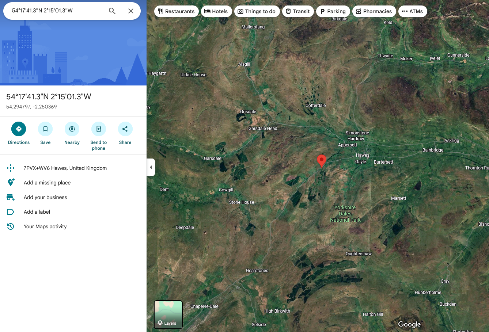
ম্যাপে `7PVX+WV6 Hawes, United Kingdom` দেখালো লোকেশন।

Hawes কি কোনো শহরের নাম?
THM এ একটা প্রশ্ন ছিলো `What city is this person in?` 

Hawes-ই কি এর উত্তর?

সাবমিট করে পেলাম Wrong answer :(

আচ্ছা, এটা আপাতত থাকুক। অন্য অ্যাট্রিবিউট নিয়ে একটু ঘাটাঘাটি করি।
EXIF Data এর Copyright এর নাম দেওয়া OWoodflint। দেখে তো কোনো ইউজারনেইম মনে হচ্ছে। গুগলে সার্চ করি তো! 

### Profile Discovery
গুগল সার্চে Exact result আসার জন্য OWoodflint এর আগে পরে "" অ্যাড করে সার্চ দিলাম।

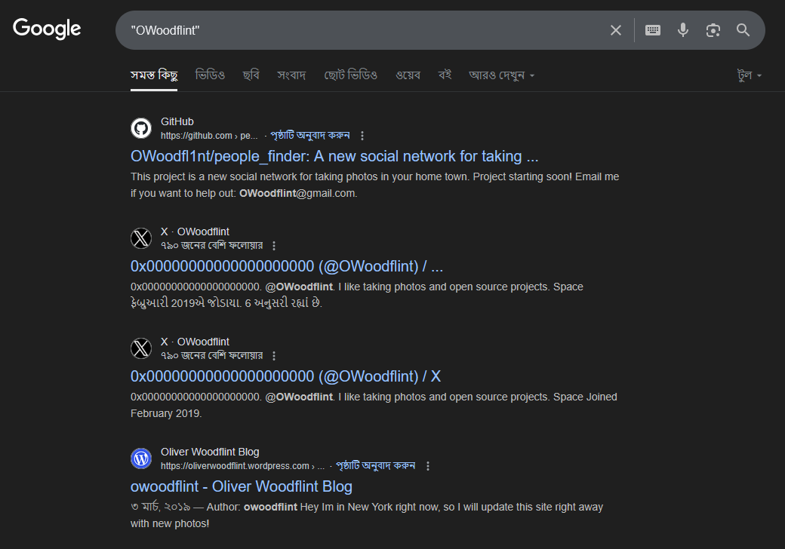

Hmmmmmm, interesting!

GitHub এর রেজাল্টে ঢুকলাম। 


ইমেইল দেওয়া আছে! 

THM এর একটা প্রশ্ন ছিলো `What is his personal email address?` 

সাবমিট করলাম। 

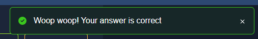

Accepted!

পরের প্রশ্ন `What site did you find his email address on?`

Github এ পেয়েছি ইমেইল।


Accepted!

### Social Media Analysis
Github এর README তে বলা আছে তার টুইটার (X) ইউজার নেইম `owoodflint`। গেলাম টুইটার এ। 

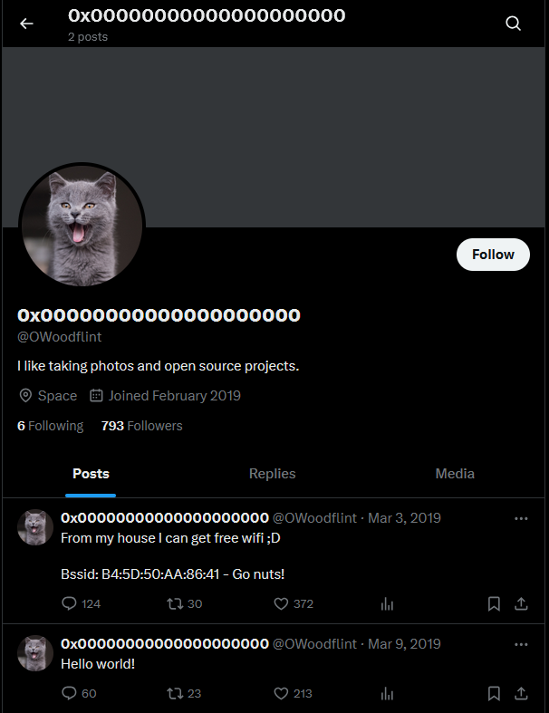

Ahha! cats! Who doesn't love cats!

সাথে পেয়ে গেলাম THM এর আরেকটা প্রশ্নের উত্তর `What is this user's avatar of?`

Answer: cat

ইউজারের X এর একটা পোস্টে বলা আছে
```
From my house I can get free wifi ;D

Bssid: B4:5D:50:AA:86:41 - Go nuts!
```

### WiFi Information
BSSID কী?

গুগল বললো, `BSSID, or Basic Service Set Identifier, is a unique identifier for a Wi-Fi access point (AP)`

আচ্ছা। ওয়াইফাই এর কোনো একটা ইউনিক আইডেন্টিফায়ার। বুঝলাম। এ থেকে ওয়াইফাই এর নাম কিভাবে বের করবো?

গুগলে "BSSID to wifi name" লিখে সার্চ করে একটা ওয়েবসাইট পেলাম [https://wigle.net/](https://wigle.net/)

এখানে BSSID আর Latitude Longitude এর রেঞ্জ দিলে BSSID এর ডিটেইলস দেখা যাবে।

wigle এ গিয়ে BSSID তে `B4:5D:50:AA:86:41` দিলাম। কিন্তু Latitude আর Longitude? এগুলো কোথায় পাবো!

টাস্কে দেওয়া ছবিতে একটা জিপিএস কো-অর্ডিনেট পেয়েছিলাম! লোকেশন ছিলো United Kingdom!

wigle এ ম্যাপ নিয়ে UK এর উপরে সেট করলাম। Coloring এর জন্য ঠিকভাবে দেখতে পারছিলাম না। তাই ডানপাশে coloring এর ভ্যাল্যু সেট করলাম channel.

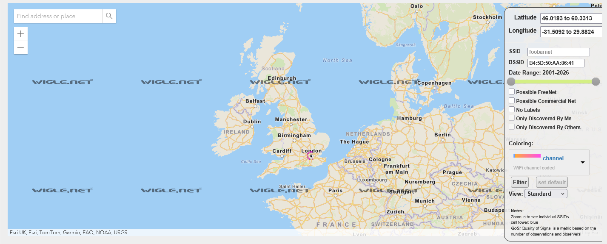

একটা পয়েন্ট দেখা যাচ্ছে London এর উপরে! City name কি তাহলে London?!

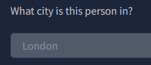

Yesss! Accepted!

wigle এ আরো জুম করা যাক। 


লগ-ইন করা ছাড়া ওয়াইফাই এর ডিটেইলস দেখার ফিচার ইউজ করা যাবেনা। অ্যাকাউন্ট খুলে লগিন করে নিলাম। 

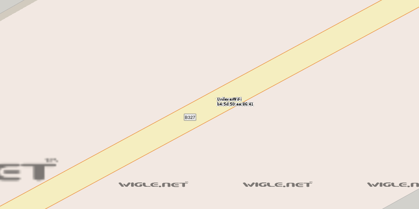

Wifi name: UnileverWifi আর নিচে BSSID লেখা।

সাবমিট করে দেখা যাক!


Accepted!

বাকি রইল ২টা প্রশ্ন।
- Where has he gone on holiday?
- What is the person's password?

GitHub এর প্রোজেক্ট পেইজে আবার ফিরে যাই।

```Hi all, I am from London, I like taking photos and open source projects. 

Follow me on twitter: @OWoodflint

This project is a new social network for taking photos in your home town.

Project starting soon! Email me if you want to help out: OWoodflint@gmail.com

https://oliverwoodflint.wordpress.com/
```

### Blog Post Analysis
ইউজারের একটা ওয়েবসাইটের লিংক দেওয়া আছে এখানে। লিংকে গিয়ে দেখি কি আছে!

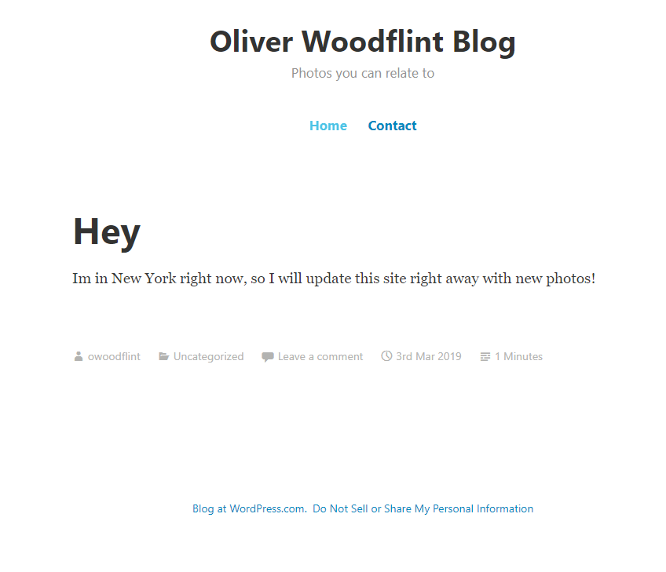

New York!

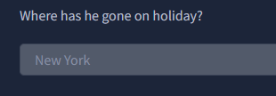

Yess! 

এবারে বাকি রইল পাসওয়ার্ড। সাইটের সোর্স কোড চেক করার জন্য সাইটে রাইট ক্লিক করে `View page source` এ দিলাম।

সোর্স কোড চেক করতে করতে ইন্টারেস্টিং একটা বিষয় চোখে পড়লো। 

ইউজারের ব্লগ পোস্টের লেখার নিচে আরো একটা লেখা আছে, যেটা paragraph ট্যাগ এর মধ্যে আছে। কাজেই এটা তো ওয়েবসাইটে দেখতে পারার কথা। 

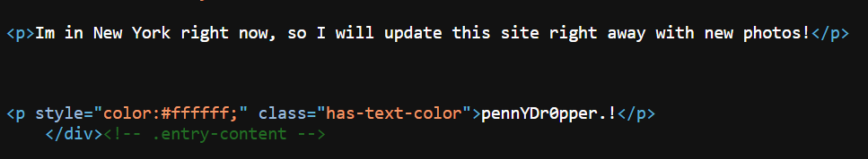

এবার আবারও ইউজারের সাইটে ঢুকলাম। অনেকসময় দেখা যায় কিছু লেখা ব্যাকগ্রাউন্ডের সাথে একই রঙের হওয়ায় দেখা যায় না। এই লেখাগুলো দেখার সহজ টেকনিক হচ্ছে `Ctrl + a` চেপে সাইটের সবকিছু সিলেক্ট করা। 


Yup! অইযে দেখা যাচ্ছে লেখাটা। এটাই কি তাহলে পাসওয়ার্ড?

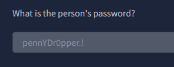

Yess! Accepted!

