# TryHackMe OHSINT Solution
Room: [OHSINT](https://tryhackme.com/room/ohsint)
Difficulty: Easy
Tags: OSINT, CTF, Write up

### Setup
First, like solving any other THM room, I went to the [room link](https://tryhackme.com/room/ohsint) and joined the room.
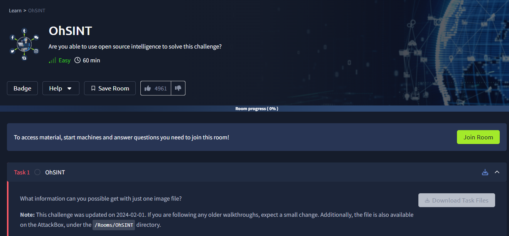

After downloading the task file, I found only the image below was given.


Looking at the task questions, I was a bit stunned. Starting from what the user's avatar is, to where the user went on holiday, which WiFi they connected to, and even their password(!) - all this was being asked with just one image! Which user are they talking about? How am I supposed to extract so much information!

I need to examine this matter carefully.

### EXIF Data Analysis
First, I checked the EXIF data of the image. There are many websites online where you can check EXIF data. One such website is [exif.tools](https://exif.tools/)

I uploaded the task image to exif.tools and found several interesting attributes.
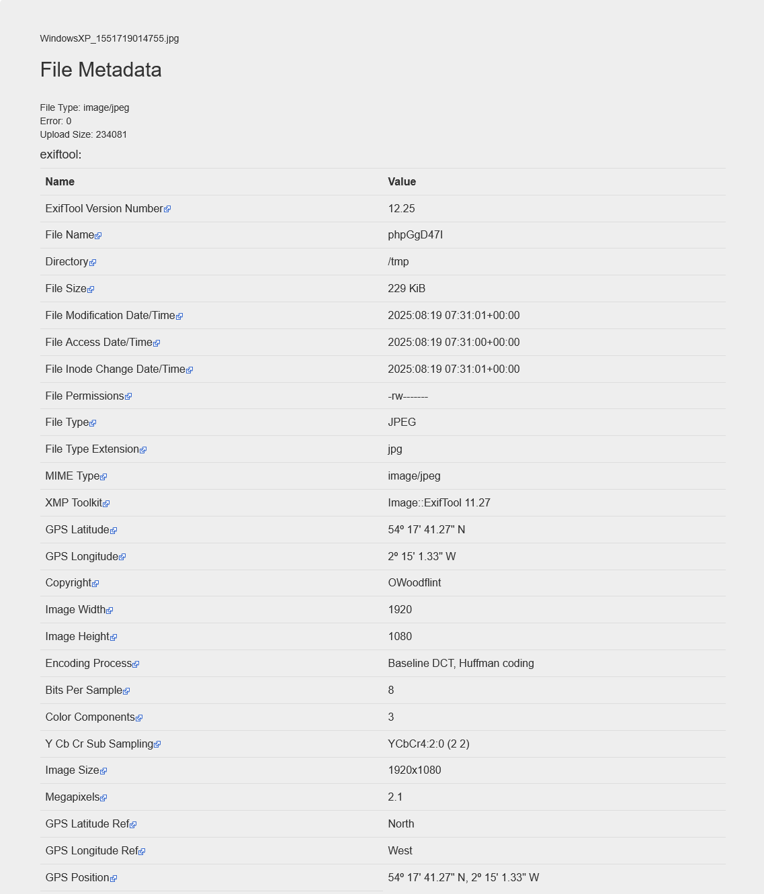

I saw that GPS coordinates were given in the EXIF data. I searched Google Maps with the GPS coordinates.

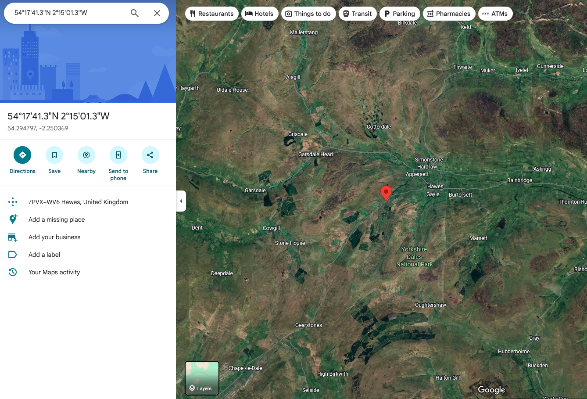
The map showed the location as `7PVX+WV6 Hawes, United Kingdom`.

Is Hawes the name of a city?
There was a question in THM: `What city is this person in?`

Is Hawes the answer to this?

I submitted it and got Wrong answer :(

Alright, let's leave this for now. Let me dig around with other attributes.
The name given in the Copyright of EXIF Data is OWoodflint. It looks like a username. Let me Google it!

### Profile Discovery
I searched Google with "" before and after OWoodflint for exact results.

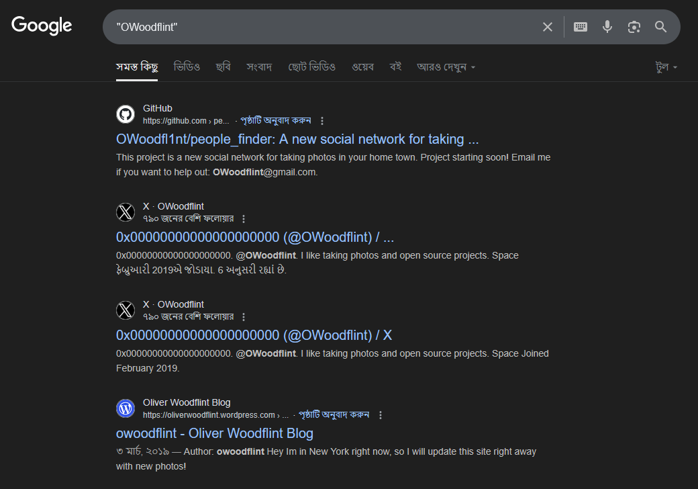

Hmmmmmm, interesting!

I went into the GitHub result.
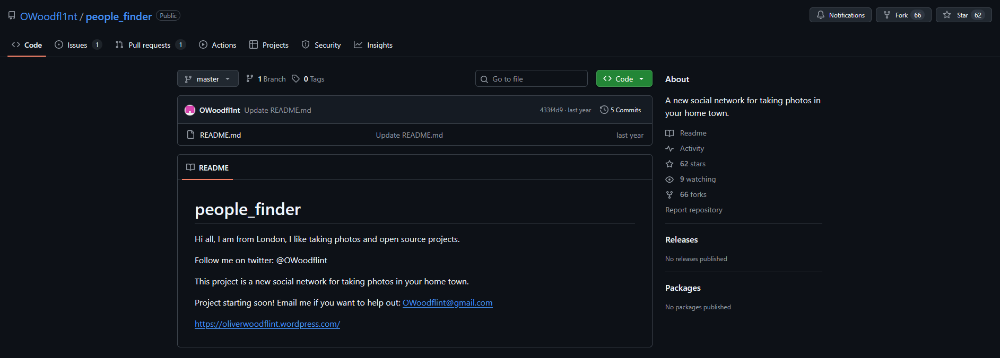

There's an email address!

There was a THM question: `What is his personal email address?`

I submitted it.

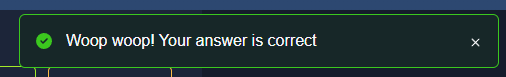

Accepted!

Next question: `What site did you find his email address on?`

I found the email on Github.


Accepted!

### Social Media Analysis
In the GitHub README, it says his Twitter (X) username is `owoodflint`. I went to Twitter.

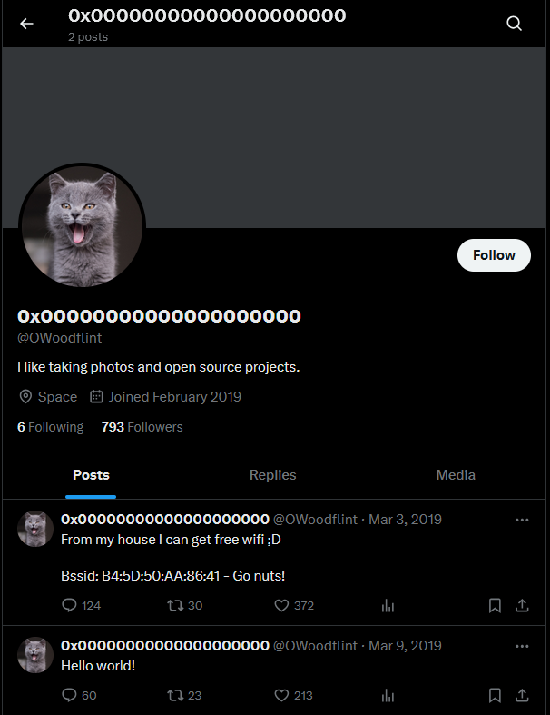

Ahha! cats! Who doesn't love cats!

I also found the answer to another THM question: `What is this user's avatar of?`

Answer: cat

In one of the user's X posts, it says:
```
From my house I can get free wifi ;D

Bssid: B4:5D:50:AA:86:41 - Go nuts!
```

### WiFi Information
What is BSSID?

Google said, `BSSID, or Basic Service Set Identifier, is a unique identifier for a Wi-Fi access point (AP)`

I see. It's some unique identifier for WiFi. Got it. How do I extract the WiFi name from this?

I searched Google for "BSSID to wifi name" and found a website [https://wigle.net/](https://wigle.net/)

Here, if you provide BSSID and the range of Latitude Longitude, you can see the details of the BSSID.

I went to wigle and entered `B4:5D:50:AA:86:41` in BSSID. But Latitude and Longitude? Where do I get these!

I had found a GPS coordinate in the image given in the task! The location was United Kingdom!

I set the map on wigle over the UK. I couldn't see properly due to coloring issues. So I set the coloring value to channel on the right side.

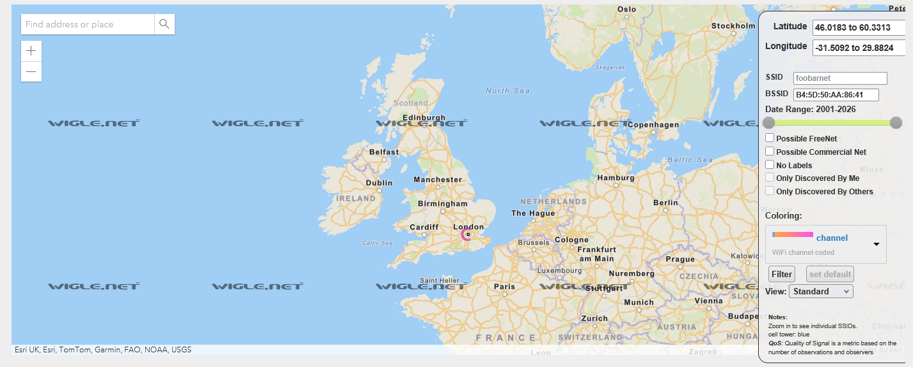

A point is visible above London! Is the city name London then?!

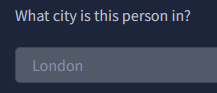

Yesss! Accepted!

Let me zoom more on wigle.

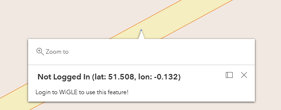

Without logging in, I can't use the feature to see WiFi details. I created an account and logged in.

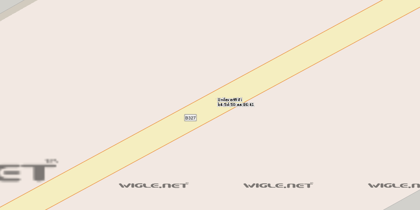

Wifi name: UnileverWifi and BSSID is written below.

Let me submit and see!

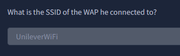

Accepted!

Two questions remain:
- Where has he gone on holiday?
- What is the person's password?

Let me go back to the GitHub project page.

```Hi all, I am from London, I like taking photos and open source projects. 

Follow me on twitter: @OWoodflint

This project is a new social network for taking photos in your home town.

Project starting soon! Email me if you want to help out: OWoodflint@gmail.com

https://oliverwoodflint.wordpress.com/
```
### Blog Post Analysis
There's a link to the user's website here. Let me go to the link and see what's there!

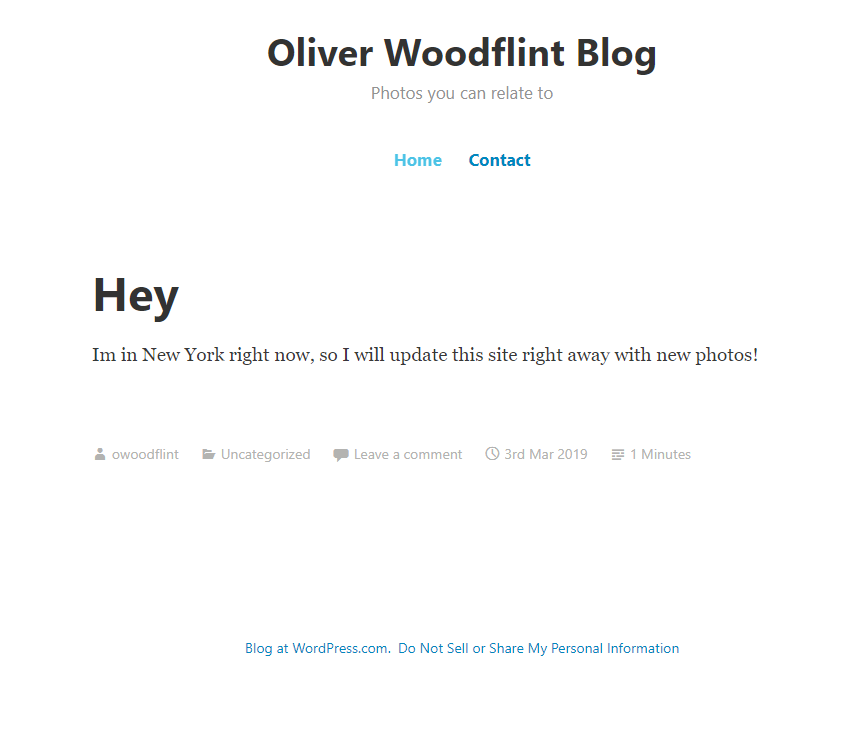

New York!

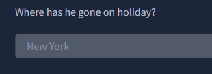

Yess!

Now only the password remains. To check the site's source code, I right-clicked on the site and went to `View page source`.

While checking the source code, something interesting caught my eye.

Below the user's blog post text, there's another text inside a paragraph tag. So this should be visible on the website.

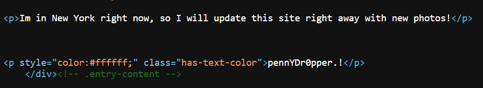

Now I entered the user's site again. Sometimes you see that some text isn't visible because it's the same color as the background. An easy technique to see these texts is to press `Ctrl + a` to select everything on the site.

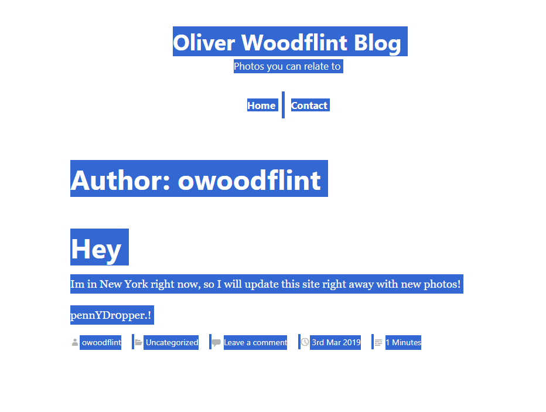

Yup! There the text is visible. Is this the password then?

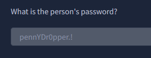

Yess! Accepted!

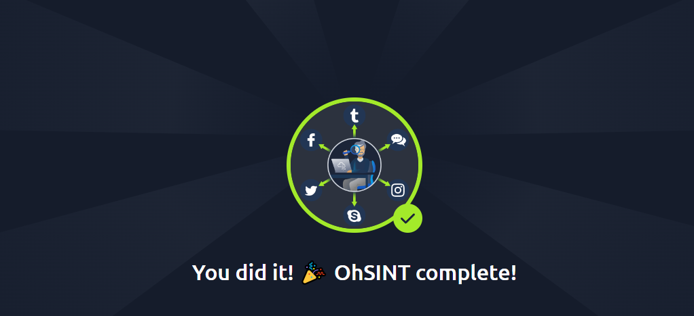
