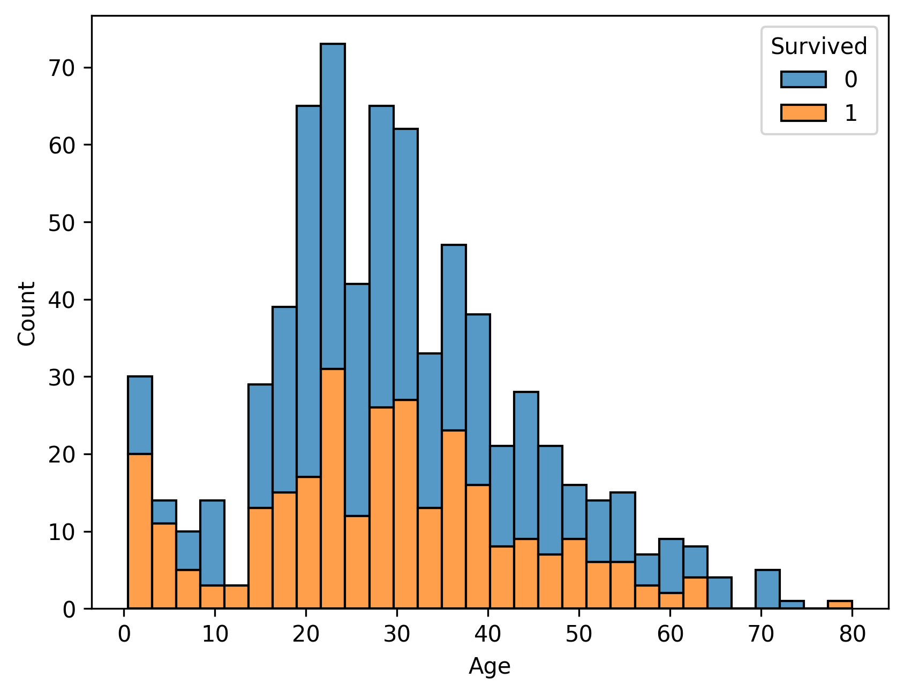
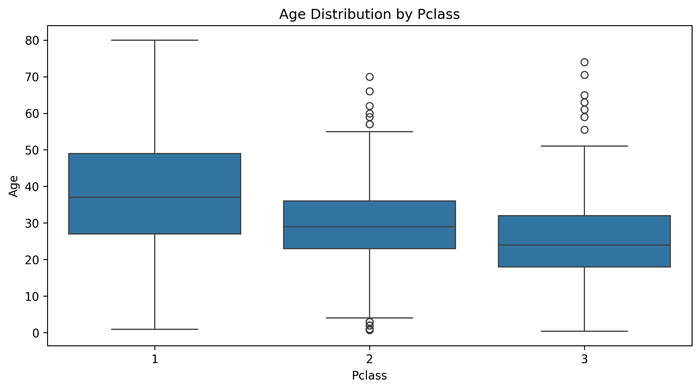
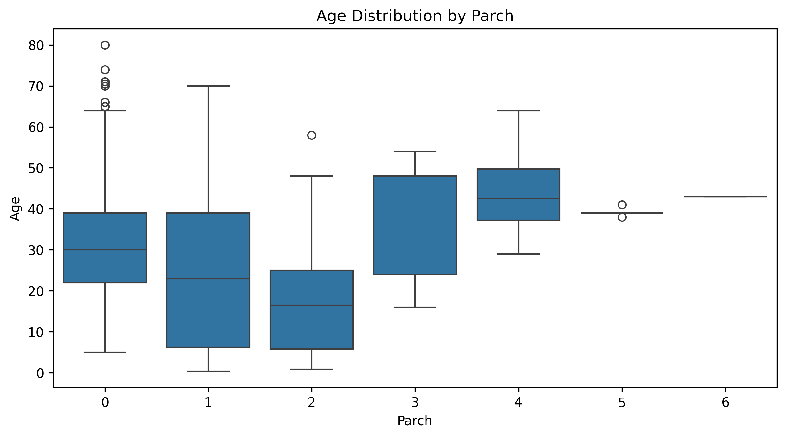
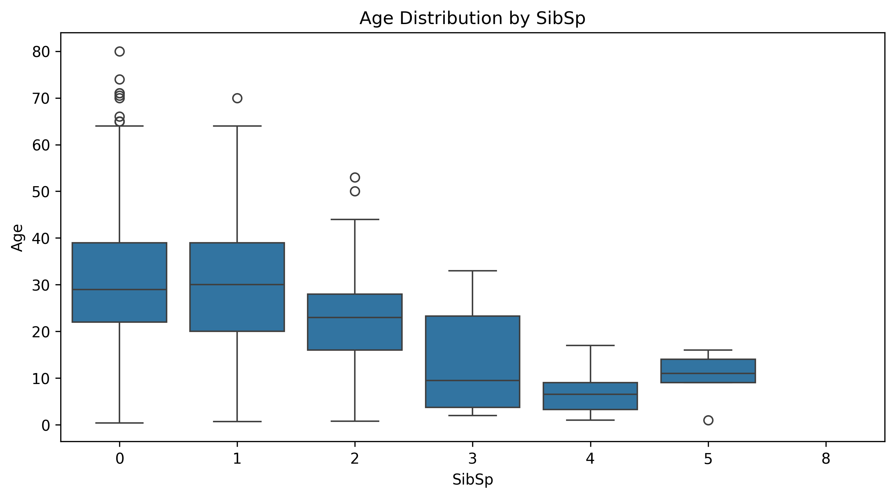
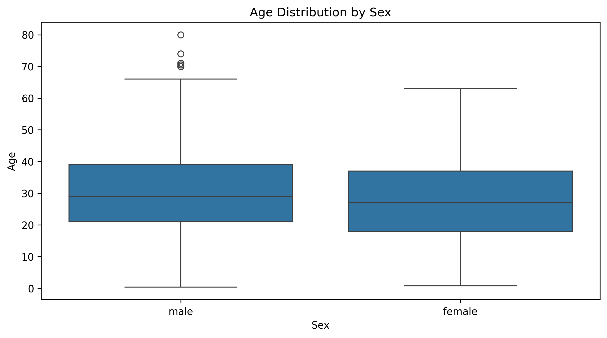
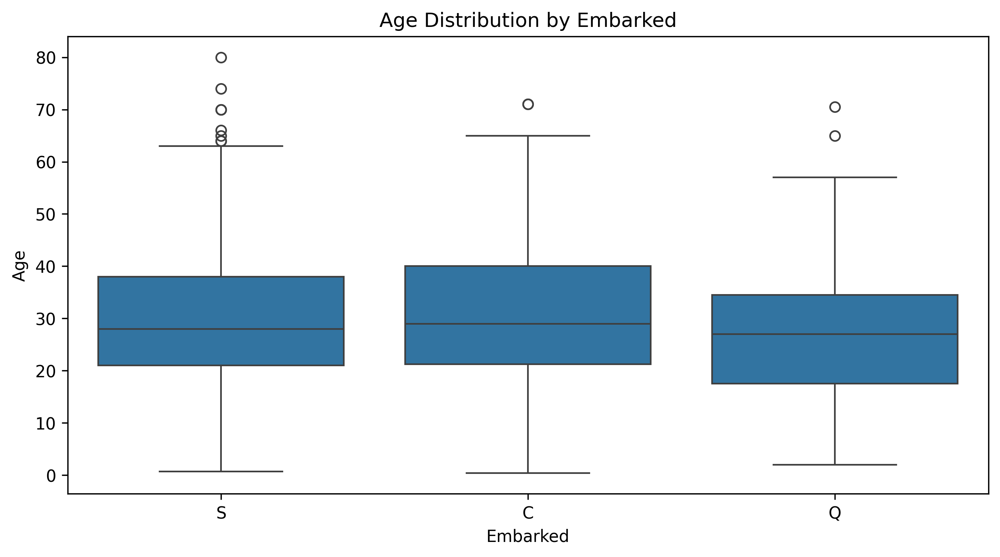
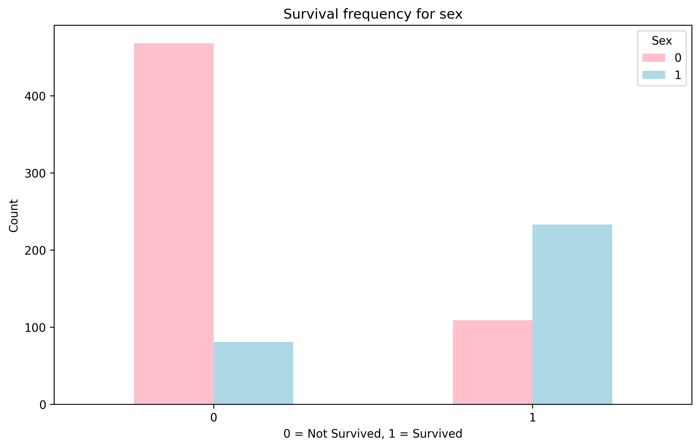
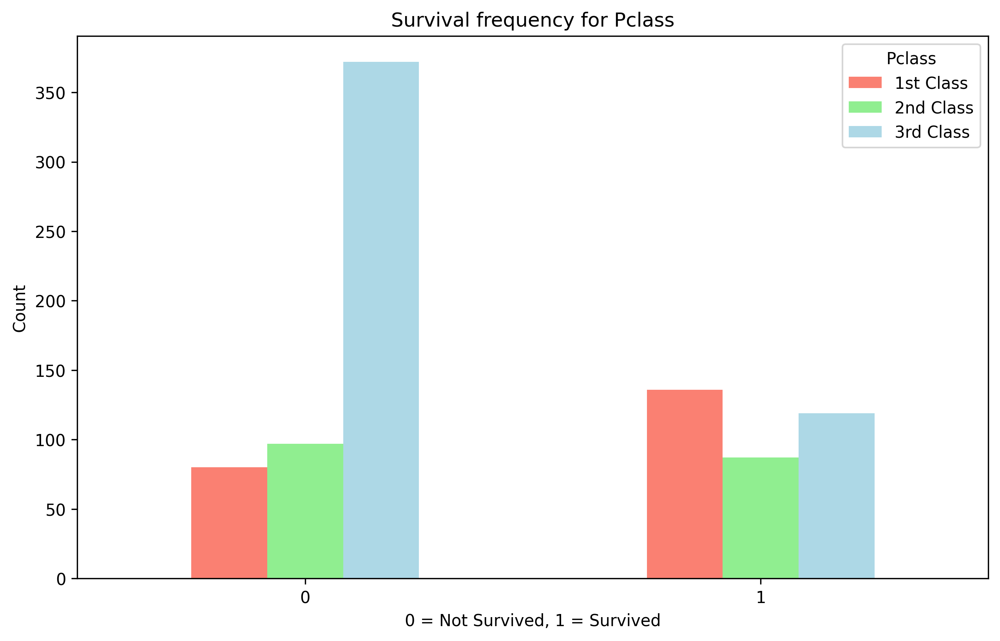
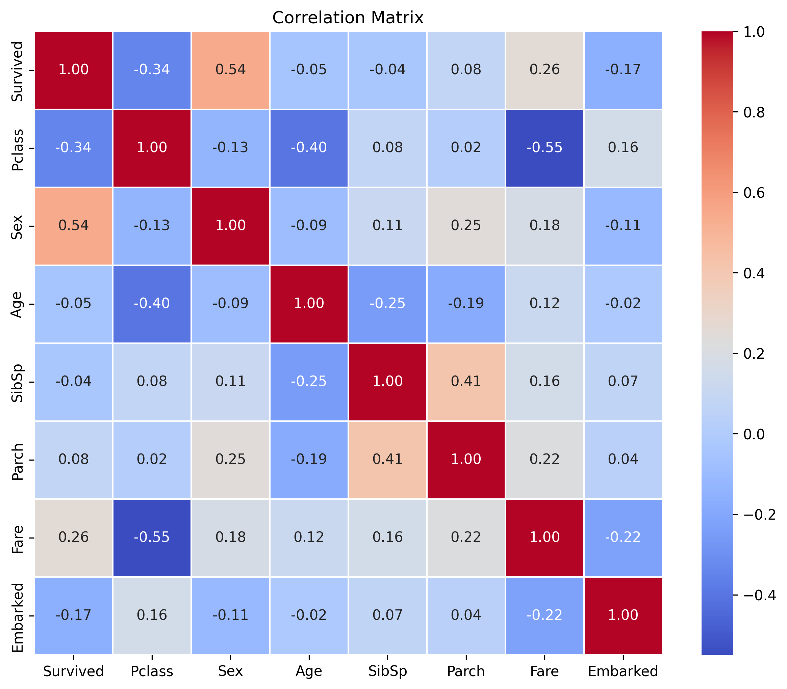

# Titanic Survival Prediction Tutorial 🚢

Welcome to my walkthrough of the classic Titanic dataset! This is one of those legendary machine learning problems that everyone tackles at some point. We're going to predict who survived the Titanic disaster based on passenger data. 

> **Want to follow along?** You can find the complete Jupyter notebook for this tutorial [here](https://github.com/ItsTHEAvro/notes/blob/main/docs/kaggle/titanic/notebook/titanic_notebook.ipynb).
> 
> **Kaggle Competition:** This tutorial is based on the [Titanic - Machine Learning from Disaster](https://www.kaggle.com/competitions/titanic/) competition on Kaggle.

## What We're Trying to Solve

The big question is simple: **Can we predict whether a passenger survived the Titanic disaster based on their personal information?** 

We'll dive into the data, clean it up, find some interesting patterns, and build a few models to see what works best. No fancy hyperparameter tuning here – just good old-fashioned data science!

## Setting Up Our Workspace

First things first, let's import all the libraries we need. Nothing too crazy here:

```python
# regular EDA and plotting libraries
import numpy as np
import pandas as pd
import matplotlib.pyplot as plt
import seaborn as sns

# to split the dataset into training and testing sets
from sklearn.model_selection import train_test_split

# models we'll try out
from sklearn.linear_model import LogisticRegression  # logistic regression
from sklearn.neighbors import KNeighborsClassifier   # k-nearest neighbors
from sklearn.ensemble import RandomForestClassifier  # random forest
```

## Loading Our Data

Let's see what we're working with:

```python
# Loading the dataset
train_data = pd.read_csv('../data/train.csv')

# Take a peek at the first few rows
train_data.head()

# And the last few rows too
train_data.tail()

# Get some basic stats
train_data.describe()
```

## Understanding Our Data

Before we dive in, let's understand what each column means:

| Variable | Definition                                   | Key                                        |
| :------- | :------------------------------------------- | :----------------------------------------- |
| `survival` | Survival                                     | `0` = No, `1` = Yes                        |
| `pclass`   | Ticket class                                 | `1` = 1st, `2` = 2nd, `3` = 3rd            |
| `sex`      | Sex                                          |                                            |
| `Age`      | Age in years                                 |                                            |
| `sibsp`    | # of siblings / spouses aboard the Titanic   |                                            |
| `parch`    | # of parents / children aboard the Titanic   |                                            |
| `ticket`   | Ticket number                                |                                            |
| `fare`     | Passenger fare                               |                                            |
| `cabin`    | Cabin number                                 |                                            |
| `embarked` | Port of Embarkation                          | `C` = Cherbourg, `Q` = Queenstown, `S` = Southampton |

## Exploratory Data Analysis (EDA)

Time for the fun part! Let's answer some important questions:

1. What question(s) are we trying to solve?
2. What kind of data do we have and how do we treat different types?
3. What's missing from the data and how do we deal with it?
4. Where are the outliers and why should we care about them?
5. How can we add, change or remove features to get more out of our data?

### Checking Our Target Variable

```python
# Check the value counts of each class
train_data['Survived'].value_counts()

# Check our data structure
train_data.info()
```

### The Missing Data Problem

Let's see what's missing:

```python
# Check for missing values
train_data.isna().sum()

# missing values percentage
print((train_data.isnull().mean() * 100).round(2).astype(str) + " %")
```

Age has 177 missing values, which is about 19.87% of our data. That's a lot! But before we panic, let's see if age even matters for survival.

### Does Age Matter for Survival?

```python
# Let's check survival by age
sns.histplot(data = train_data,
             x = 'Age',
             hue = 'Survived',
             multiple = 'stack',
             bins = 30)
```



Interesting! We can see that between 0 and 10 years, most passengers survived. So age definitely matters – we can't just throw it away.

### Smart Age Imputation

Instead of just filling missing ages with the overall median (boring!), let's be smarter about it. We'll fill missing values based on similar passengers:

```python
# Let's see which columns relate to Age
cols = ['Pclass', 'Parch', 'SibSp', 'Sex', 'Embarked']

for col in train_data[cols]:
    plt.figure(figsize=(10, 5))
    sns.boxplot(x=col, y='Age', data=train_data)
    plt.title(f'Age Distribution by {col}')
    plt.show()
```

Here are the age distribution plots that help us understand which features are related to age:


 




After looking at the plots, we can see that the different categories of the Sex column (male, female) have similar median ages, and the same goes for the categories in the Embarked column (S, C, Q). Because of this, using these columns for age imputation might introduce bias without much benefit. On the other hand, the categories in Pclass, Parch, and SibSp show more variation in median ages. So, we will group by these columns and use their median ages to fill in the missing values.

```python
# Group by Pclass, SibSp, Parch and get the median age for each group
grouped_median = train_data.groupby(['Pclass', 'SibSp', 'Parch'])['Age'].median()
overall_median_age = train_data['Age'].median()

# Create a smart function to fill missing ages
def fill_missing_age(row):
    if pd.isnull(row['Age']):
        key = (row['Pclass'], row['SibSp'], row['Parch'])
        if key in grouped_median.index:
            return grouped_median.loc[key]
        else:
            return overall_median_age  # fallback to overall median
    return row['Age']

# Apply our smart function
train_data['Age'] = train_data.apply(fill_missing_age, axis=1)
train_data['Age'] = train_data['Age'].fillna(overall_median_age)  # just to be safe
```

### Finding Patterns in the Data

Now for the really fun part – let's see what patterns emerge!

#### Gender and Survival

```python
# Survival frequency according to sex
train_data.Sex.value_counts()

# Compare Survived column with Sex column
pd.crosstab(train_data.Survived, train_data.Sex)

# Create a nice visualization
pd.crosstab(train_data.Survived, train_data.Sex).plot(kind="bar",
                                                      figsize=(10, 6),
                                                      color=["pink", "lightblue"])

plt.title("Survival frequency for sex")
plt.xlabel("0 = Not Survived, 1 = Survived")
plt.ylabel("Count")
plt.xticks(rotation=0)
plt.show()
```



Classic "women and children first" pattern! Women had a much higher survival rate.

#### Class and Survival

```python
# survival frequency according to Pclass
train_data.Pclass.value_counts()

# compare pclass to survived
pd.crosstab(train_data.Survived, train_data.Pclass)

pd.crosstab(train_data.Survived, train_data.Pclass).plot(kind="bar",
                                                         figsize=(10, 6),
                                                         color=["salmon", "lightgreen", "lightblue"])
plt.title("Survival frequency for Pclass")
plt.xlabel("0 = Not Survived, 1 = Survived")
plt.legend(title="Pclass", labels=["1st Class", "2nd Class", "3rd Class"])
plt.ylabel("Count")
plt.xticks(rotation=0)
plt.show()
```



Money talks! First-class passengers had way better survival rates. Not surprising, really.

### Dealing with Other Missing Values

We've got 2 missing values in the Embarked column. Easy fix:

```python
# Check the value counts of the Embarked column
train_data['Embarked'].value_counts()

# Fill missing values with the most common value
train_data['Embarked'] = train_data['Embarked'].fillna('S')
```

### Creating a Correlation Matrix

Before we model, let's see how everything correlates:

```python
# Convert categorical variables to numeric
train_data['Sex'] = train_data['Sex'].str.lower().map({'male': 0, 'female': 1})
train_data['Embarked'] = train_data.Embarked.map({'C': 0, 'Q': 1, 'S': 2})

# Get numeric columns and create correlation matrix
numeric_cols = train_data.select_dtypes(include=[np.number]).columns.tolist()
correlation_matrix = train_data[numeric_cols].corr()

# Plot the correlation matrix
plt.figure(figsize=(10, 8))
sns.heatmap(correlation_matrix, annot=True, cmap='coolwarm', fmt='.2f', linewidths=0.5)
plt.title("Correlation Matrix")
plt.show()
```



### Feature Selection

Let's drop the columns that won't help our model:

```python
# Drop columns that are not useful for our model
train_data = train_data.drop(["Ticket", "Cabin", "PassengerId", "Name"], axis=1)
```

## Building Our Models

Time to build some models! We'll keep it simple and try three different approaches:

```python
# Split data into features and target
X = train_data.drop(columns=['Survived'])
y = train_data['Survived']

# Split into training and testing sets
X_train, X_test, y_train, y_test = train_test_split(X, y, test_size=0.2, random_state=42)
```

### Model Selection

We'll try 3 different models:
1. **Logistic Regression**
2. **K-Nearest Neighbors**
3. **Random Forest**

```python
# Put models in a dictionary
models = {"LogisticRegression": LogisticRegression(),
          "KNeighborsClassifier": KNeighborsClassifier(),
          "RandomForestClassifier": RandomForestClassifier()}

# Create a function to train and evaluate models
def train_and_evaluate(models, X_train, y_train, X_test, y_test):
    """
    Train and evaluate multiple models on the given training and testing data.
    """
    results = {}
    for name, model in models.items():
        model.fit(X_train, y_train)
        score = model.score(X_test, y_test)
        results[name] = score
        print(f"{name} Accuracy: {score:.4f}")
    return results

# Train and evaluate our models
results = train_and_evaluate(models, X_train, y_train, X_test, y_test)
```

Here are our model results:

```
LogisticRegression Accuracy: 0.8101
KNeighborsClassifier Accuracy: 0.7207
RandomForestClassifier Accuracy: 0.8212
```

From our results, **RandomForestClassifier performs best** with an accuracy of 82.12%, followed closely by Logistic Regression at 81.01%. K-Nearest Neighbors trails behind at 72.07%. Not bad for models without any hyperparameter tuning!

## Creating Our Submission

Time to make our predictions on the test data and create a submission file:

```python
def prepare_submission(test_data_path='../data/test.csv'):
    test_data = pd.read_csv(test_data_path)
    
    # Store PassengerId for submission
    passenger_ids = test_data['PassengerId'].copy()
    
    # Apply the same preprocessing steps as training data
    
    # 1. Handle missing Age values using grouped median
    grouped_median = train_data.groupby(['Pclass', 'SibSp', 'Parch'])['Age'].median()
    overall_median_age = train_data['Age'].median()
    
    def fill_missing_age(row):
        if pd.isnull(row['Age']):
            key = (row['Pclass'], row['SibSp'], row['Parch'])
            if key in grouped_median.index:
                return grouped_median.loc[key]
            else:
                return overall_median_age
        return row['Age']
    
    test_data['Age'] = test_data.apply(fill_missing_age, axis=1)
    test_data['Age'] = test_data['Age'].fillna(overall_median_age)
    
    # 2. Handle missing Embarked values
    test_data['Embarked'] = test_data['Embarked'].fillna('S')
      
    # 3. Convert categorical variables to numeric
    test_data['Sex'] = test_data['Sex'].str.lower().map({'male': 0, 'female': 1})
    test_data['Embarked'] = test_data['Embarked'].map({'C': 0, 'Q': 1, 'S': 2})
    
    # 4. Drop unnecessary columns
    test_data_processed = test_data.drop(["Ticket", "Cabin", "PassengerId", "Name"], axis=1)
    
    # 5. Train the model on full training data
    X_full = train_data.drop(columns=['Survived'])
    y_full = train_data['Survived']
    
    # Use our best model
    model = RandomForestClassifier(random_state=42)
    model.fit(X_full, y_full)
    
    # 6. Make predictions
    predictions = model.predict(test_data_processed)
    
    # 7. Create submission dataframe
    submission = pd.DataFrame({
        'PassengerId': passenger_ids,
        'Survived': predictions
    })
    
    return submission

# Create our submission
submission_df = prepare_submission()

# Save to CSV for Kaggle submission
submission_df.to_csv('titanic_submission_01.csv', index=False)
print(f"Submission saved! Total predictions: {len(submission_df)}")
```

Now that you have your `titanic_submission_01.csv` file, you can submit it to the [Kaggle Titanic competition](https://www.kaggle.com/competitions/titanic/) to see how your model performs against others! Just upload your CSV file on the competition's submission page.

## Key Takeaways

1. **Data cleaning matters**: Smart imputation of missing ages based on similar passengers worked better than simple median filling.

2. **Feature engineering helps**: Converting categorical variables to numeric and understanding relationships between features improved our model.

3. **Visualizations tell stories**: The plots clearly showed that gender, class, and age were important factors for survival.

4. **Simple models can work well**: Random Forest without hyperparameter tuning gave us our best results.

5. **"Women and children first" was real**: The data clearly shows this maritime tradition was followed during the Titanic disaster.

## What's Next?

This was just the beginning! Here are some ideas to improve the model:

- **Feature engineering**: Create new features like family size, title extraction from names, etc.
- **Hyperparameter tuning**: Use GridSearchCV or RandomSearchCV to optimize model parameters
- **Ensemble methods**: Combine multiple models for better predictions

But for now, we've got a solid baseline model that captures the main patterns in the data. Not bad for a day's work!

---

*Remember: The goal isn't just to get a high accuracy score, but to understand the story the data is telling us. In this case, it's a tragic but fascinating glimpse into one of history's most famous disasters.*
